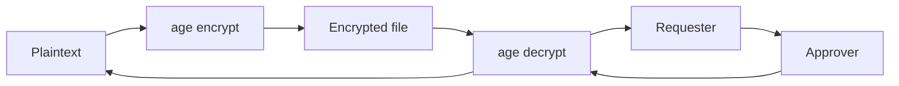

# Age & SOPS Encryption

Encrypt and decrypt secrets using Age with hardware-backed keys.

## Overview

[Age](https://age-encryption.org/) is a modern encryption tool. [SOPS](https://github.com/getsops/sops) uses Age (among others) to encrypt secrets in configuration files. AckAgent provides an Age plugin that stores your identity key on your phone, requiring biometric approval for decryption.



## Prerequisites

**1. Install the Age CLI:**

=== "macOS"

    ```bash
    brew install age
    ```

=== "Linux"

    ```bash
    # Debian/Ubuntu
    sudo apt install age

    # Or download from GitHub releases
    ```

**2. AckAgent CLI with plugin:**

The AckAgent CLI package includes `age-plugin-ackagent`. Verify it's installed and in your PATH:

```bash
which age-plugin-ackagent
```

Age automatically discovers plugins named `age-plugin-*` in your PATH. When you use an `age1ackagent1...` recipient or identity, Age invokes the plugin to handle the cryptographic operations.

## Generate an Age Identity

Create an Age identity stored on your phone:

```bash
ackagent age keygen
```

Approve on your phone. You'll see:

```
Age identity generated.
Recipient: age1ackagent1abc123...

To use with age CLI, your identity is available via the plugin.
```

The identity private key is stored on your phone. The recipient (public key) can be shared freely.

## Get Your Recipient

To encrypt files for yourself, get your recipient (public key):

```bash
ackagent age recipient
```

Output:

```
age1ackagent1qyza9h5n7c...
```

Share this recipient with anyone who should encrypt files for you.

## Encrypt Files

Encrypt a file using your recipient:

```bash
age -r age1ackagent1qyza9h5n7c... secrets.txt > secrets.txt.age
```

Or save the recipient to a file:

```bash
ackagent age recipient > ~/.age-recipients
age -R ~/.age-recipients secrets.txt > secrets.txt.age
```

## Decrypt Files

Decrypt using the AckAgent plugin:

```bash
age -d -i <(ackagent age identity) secrets.txt.age > secrets.txt
```

Your phone will show a decryption request. Approve with biometrics.

### Simplified Decryption

For convenience, you can save identities to the default location:

```bash
ackagent age identity --save
```

Then decrypt without specifying the identity:

```bash
age -d secrets.txt.age > secrets.txt
```

Age automatically uses identities from `~/.config/age/identity`.

## SOPS Integration

SOPS encrypts specific values in YAML, JSON, or ENV files while keeping keys readable.

### Install SOPS

=== "macOS"

    ```bash
    brew install sops
    ```

=== "Linux"

    ```bash
    # Download from GitHub releases
    curl -LO https://github.com/getsops/sops/releases/latest/download/sops-linux-amd64
    chmod +x sops-linux-amd64
    sudo mv sops-linux-amd64 /usr/local/bin/sops
    ```

### Configure SOPS

Create `.sops.yaml` in your project root:

```yaml
creation_rules:
  - path_regex: \.secrets\.yaml$
    age: age1ackagent1qyza9h5n7c...
```

Replace with your recipient from `ackagent age recipient`.

### Encrypt a Secrets File

Create a secrets file:

```yaml
# secrets.yaml
database:
  password: supersecret123
api:
  key: sk-abc123
```

Encrypt it:

```bash
sops -e secrets.yaml > secrets.secrets.yaml
```

The encrypted file looks like:

```yaml
database:
  password: ENC[AES256_GCM,data:...,type:str]
api:
  key: ENC[AES256_GCM,data:...,type:str]
```

Keys are readable, values are encrypted.

### Decrypt and Edit

To decrypt and edit:

```bash
SOPS_AGE_KEY_CMD="ackagent age identity" sops secrets.secrets.yaml
```

Your phone will prompt for approval. After editing, SOPS re-encrypts automatically.

### Decrypt to stdout

```bash
SOPS_AGE_KEY_CMD="ackagent age identity" sops -d secrets.secrets.yaml
```

## Shell Integration

Add to your shell profile (`~/.bashrc` or `~/.zshrc`):

```bash
export SOPS_AGE_KEY_CMD="ackagent age identity"
```

Now `sops` commands automatically use your AckAgent identity.

## Multiple Recipients

Encrypt for multiple people:

```bash
age -r age1ackagent1abc... -r age1ackagent1xyz... secrets.txt > secrets.txt.age
```

Or in `.sops.yaml`:

```yaml
creation_rules:
  - path_regex: \.secrets\.yaml$
    age: >-
      age1ackagent1abc...,
      age1ackagent1xyz...
```

Anyone with a matching identity can decrypt.

## Troubleshooting

### "No identity found"

Ensure you've generated an identity:

```bash
ackagent age keygen  # If not already done
```

### Plugin Not Found

The plugin should be installed automatically with the CLI. Verify:

```bash
which age-plugin-ackagent
```

If missing, reinstall the AckAgent CLI.

### SOPS Decryption Fails

1. Check the recipient in `.sops.yaml` matches your identity
2. Verify `SOPS_AGE_KEY_CMD` is set correctly
3. Ensure you're logged in: `ackagent login --config`

## Security Considerations

- **Identity private key** stays on your phone, protected by biometric authentication
- **Decryption requires biometrics** every time
- **Recipients are public** and can be committed to git
- **Encrypted files** are safe to store in version control

## Next Steps

- [Security Overview](../security/index.md) — Understand the trust model
- [CLI Reference](../reference/cli.md) — Full command documentation
