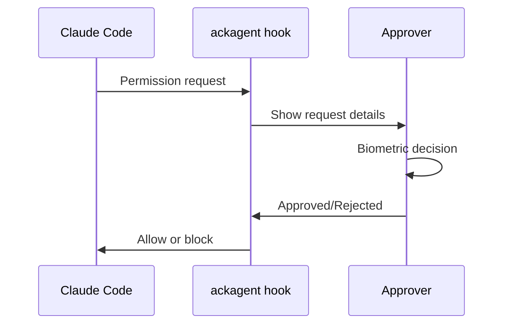

# Claude Code Approvals

Approve Claude Code tool calls from your phone with biometric authentication.

## Overview

[Claude Code](https://github.com/anthropics/claude-code) is Anthropic's agentic coding tool. It can run commands, edit files, and perform other actions on your computer. AckAgent integrates with Claude Code's permission hook system to route approval requests to your phone.

When Claude Code wants to run a command or tool that requires approval, you receive a push notification showing exactly what it wants to do. Approve or reject with biometrics.



## Configure the Hook

Set up AckAgent as Claude Code's approval hook:

```bash
ackagent hook claude --configure
```

This adds the hook to your Claude Code configuration. You can verify the configuration:

```bash
cat ~/.claude/settings.json
```

You should see:

```json
{
  "hooks": {
    "PreToolUse": [
      {
        "matcher": "*",
        "command": ["ackagent", "hook", "claude"]
      }
    ]
  }
}
```

## How It Works

1. **Claude Code requests a tool** — e.g., `Bash` to run a command
2. **The hook intercepts** — AckAgent receives the request details
3. **Your phone shows the request** — command, arguments, context
4. **You decide** — approve or reject with biometrics
5. **Claude Code proceeds** — or stops if rejected

## Request Details

When a request arrives on your phone, you'll see:

- **Tool name** — what Claude Code wants to use (Bash, Write, Edit, etc.)
- **Arguments** — the specific command or file operation
- **Context** — where the request originated from

!!! example "Example Request"
    **Tool:** Bash
    **Command:** `npm install express`
    **Context:** Installing dependencies for web server

## Usage

Once configured, just use Claude Code normally. Requests that need approval will trigger a push notification.

### Approve

Tap **Approve** and authenticate with Face ID/Touch ID to allow the operation.

### Reject

Tap **Reject** to block the operation. Claude Code will see the rejection and adjust its approach.

## Configuration Options

### Selective Matching

You can configure the hook to only trigger for specific tools:

Edit `~/.claude/settings.json`:

```json
{
  "hooks": {
    "PreToolUse": [
      {
        "matcher": "Bash",
        "command": ["ackagent", "hook", "claude"]
      },
      {
        "matcher": "Write",
        "command": ["ackagent", "hook", "claude"]
      }
    ]
  }
}
```

This only requires approval for Bash commands and file writes, not for read operations.

### Disable the Hook

To disable AckAgent approval temporarily, remove the hook entry from `~/.claude/settings.json` manually.

## Troubleshooting

### Requests Not Appearing

1. **Check notifications** — ensure AckAgent notifications are enabled on your phone
2. **Verify login** — run `ackagent login --config` to check status
3. **Check hook configuration** — verify `~/.claude/settings.json` has the hook

### Timeouts

By default, requests timeout after 2 minutes. If you don't respond in time, Claude Code sees a rejection.

To avoid timeouts:
- Keep your phone nearby when using Claude Code
- Respond promptly to notifications

### Hook Not Running

If Claude Code isn't calling the hook:

1. Verify the configuration file syntax is valid JSON
2. Check that `ackagent` is in your PATH
3. Try running the hook manually: `echo '{"tool":"test"}' | ackagent hook claude`

## Security Considerations

- **Every tool call** can require your approval
- **You see the actual command** before it runs
- **Rejection is permanent** — Claude Code must try a different approach
- **Context is shown** — understand why the request was made

This provides human-in-the-loop oversight for AI agents operating on your system.

## Next Steps

- [Age + SOPS Encryption](age-sops.md) — Encrypt secrets with Age
- [Security Overview](../security/index.md) — Understand the trust model
