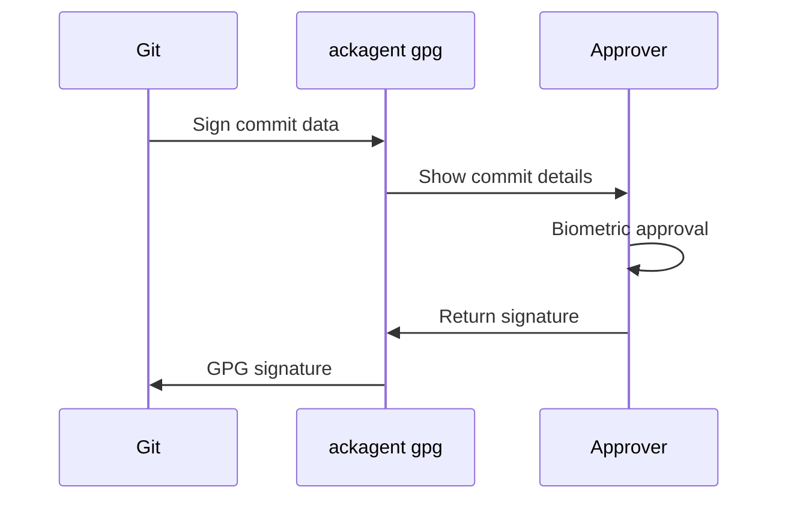

# Git Commit Signing

Sign your git commits with GPG-compatible keys stored on your phone.

## Overview

AckAgent provides a GPG-compatible interface for git signing. When you commit, git calls `ackagent gpg` which sends the data to your phone for approval. You see the commit details, authenticate with biometrics, and the signature is returned.



## Key Options

AckAgent supports multiple GPG key configurations:

| Algorithm | Storage Options | Sync | Notes |
|-----------|-----------------|------|-------|
| P-256 ECDSA | Hardware or Software | Hardware: No, Software: Yes | Hardware-backed for maximum security |
| Ed25519 | Software only | Yes | Wider compatibility, can sync |

## Generate a GPG Key

### P-256 Key (Hardware-Backed)

```bash
ackagent gpg --generate-key --name "Your Name" --email "you@example.com"
```

This creates a P-256 ECDSA key on your phone. P-256 keys can be stored in your phone's Secure Enclave (iOS) or StrongBox (Android) for hardware-backed security, or in software with optional cross-device sync. You choose the storage mode when you approve the key generation on your phone.

### Ed25519 Key (Software-Backed)

```bash
ackagent gpg --generate-key --name "Your Name" --email "you@example.com" --type ed25519
```

Ed25519 keys are always software-backed and can be synced across your Approver devices.

---

You'll receive a push notification to approve the key generation. After approval, you'll see:

```
GPG key generated:
  Key ID: ABC123DEF456
  Fingerprint: 1234 5678 9ABC DEF0 ...
  User ID: Your Name <you@example.com>

Public key exported to: ~/.gnupg/ackagent-pubkey.asc
```

## Configure Git

Tell git to use AckAgent for signing:

```bash
# Set the signing key
git config --global user.signingkey "ABC123DEF456"

# Use ackagent as the GPG program
git config --global gpg.program "ackagent gpg"

# Sign all commits by default (optional)
git config --global commit.gpgsign true
```

## Sign Commits

With configuration complete, commits are signed automatically:

```bash
git commit -m "Add new feature"
```

Your phone will show:

- Repository name
- Branch
- Commit message
- Author information

Approve with biometrics, and the commit is signed.

### Manual Signing

To sign a specific commit without auto-signing enabled:

```bash
git commit -S -m "This commit is signed"
```

## Verify Signatures

View signature information in git log:

```bash
git log --show-signature -1
```

Output:

```
commit abc123...
gpg: Signature made Mon Jan 15 10:30:00 2024
gpg: using ECDSA key 1234567890ABCDEF
gpg: Good signature from "Your Name <you@example.com>"
```

## GitHub Verification

To get the "Verified" badge on GitHub:

1. **Export your public key:**

    ```bash
    ackagent gpg --export
    ```

2. **Add to GitHub:**

    - Go to [GitHub SSH and GPG keys](https://github.com/settings/keys)
    - Click "New GPG key"
    - Paste the public key block
    - Click "Add GPG key"

3. **Push a signed commit:**

    Your commits will now show as "Verified" on GitHub.

## List Keys

View your GPG keys:

```bash
ackagent gpg -k
```

Output:

```
pub   nistp256 2024-01-15 [SC]
      1234567890ABCDEF1234567890ABCDEF12345678
uid           [ultimate] Your Name <you@example.com>
```

## Troubleshooting

### "No secret key" error

Ensure you're logged in and have generated a GPG key:

```bash
ackagent login --config  # Check login status
ackagent gpg -k          # List keys
```

### Signature not appearing as verified

- Ensure your public key is uploaded to GitHub/GitLab
- Check that the email in your key matches your git config email
- Verify the key ID in git config matches your AckAgent key

### Commit timeout

The default approval timeout is 2 minutes. If you don't approve in time, the commit fails. Watch for the push notification on your phone.

## Next Steps

- [SSH Keys](ssh-keys.md) — Set up SSH authentication
- [Claude Code Approvals](claude-code.md) — Approve AI tool calls
