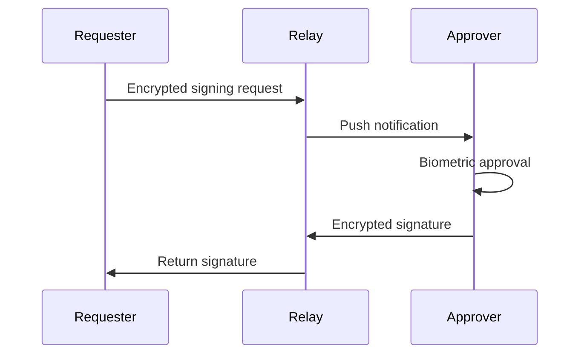

# AckAgent

**Hardware-backed cryptographic signing with mobile approval.**

AckAgent moves your signing keys to your phone's secure hardware (iOS Secure Enclave or Android StrongBox) and requires biometric approval for every signature. Your private keys never leave the device, and the server never sees your plaintext data.

## Terminology

| Term | Description |
|------|-------------|
| **Requester** | The CLI or application on your computer that initiates signing requests |
| **Approver** | The AckAgent mobile app that holds your keys and approves requests |
| **Relay** | The server that routes encrypted messages between Requester and Approver |

## How It Works



1. **You run a command** — sign a git commit, SSH into a server, or approve a Claude Code action
2. **Your phone gets a notification** — see exactly what's being signed
3. **You approve with biometrics** — Face ID, Touch ID, or fingerprint
4. **The signature is returned** — your computer receives the cryptographic signature

## Key Features

- **Hardware-backed keys** — Keys stored in Secure Enclave (iOS) or StrongBox (Android)
- **End-to-end encrypted** — The relay server never sees your requests or signatures
- **Works with existing tools** — Git, SSH, GPG, Age encryption, Claude Code
- **SAS verification** — Detect man-in-the-middle attacks during setup
- **Multi-device support** — Enroll multiple phones for redundancy

## Use Cases

| Use Case | What It Does |
|----------|--------------|
| [Git Commit Signing](guides/git-signing.md) | Sign commits with GPG-compatible keys |
| [SSH Authentication](guides/ssh-keys.md) | SSH into servers with hardware-backed keys |
| [Claude Code Approvals](guides/claude-code.md) | Approve AI tool calls from your phone |
| [Age + SOPS Encryption](guides/age-sops.md) | Encrypt/decrypt secrets with Age |

## Quick Start

1. **Install the mobile app** and create your account

    - [iOS App Store](https://apps.apple.com/app/ackagent)
    - [Google Play Store](https://play.google.com/store/apps/details?id=dev.ackagent)

2. **Install the CLI**

    === "macOS"

        ```bash
        brew install --cask ackagent/tap/ackagent
        ```

    === "Linux"

        ```bash
        brew install ackagent/tap/ackagent
        ```

        deb and rpm packages are also available from [GitHub Releases](https://github.com/ackagent/ackagent/releases).

3. **Log in and pair your device**

    ```bash
    ackagent login
    ```

    Scan the QR code with the AckAgent app, then verify the security code matches on both screens.

Ready to get started? Head to the [getting started guide](getting-started/index.md).
