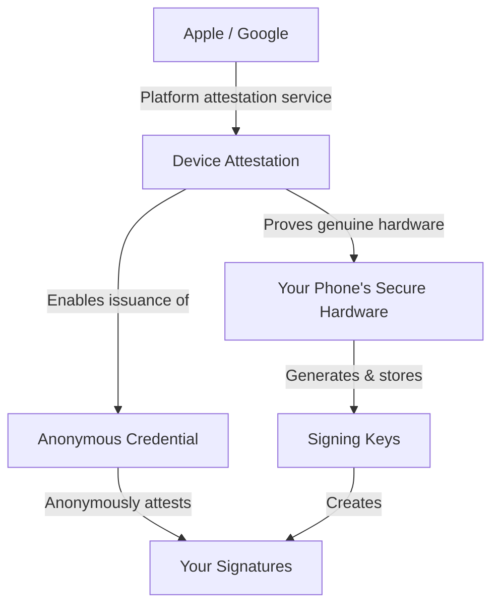

# Security Overview

This page explains where your data comes from and how it's protected, so you can make informed decisions about what you trust.

## Chain of Trust

AckAgent's security relies on a chain of trust rooted in platform attestation:

### Remote Attestation

When you set up AckAgent, your phone generates an attestation using Apple's App Attest (iOS) or Google's Play Integrity (Android). This cryptographically proves:

- The app is the genuine AckAgent from the App Store / Play Store
- The device has secure hardware (Secure Enclave / StrongBox)
- The attestation key was generated on that specific device

**The root of trust is Apple or Google's attestation service.** If you don't trust Apple or Google's ability to verify their own hardware, this attestation provides no assurance.

### Key Binding

Your signing keys are bound to your device through attestation:

1. During setup, the app generates a Device Attestation Key inside secure hardware
2. Apple/Google signs an attestation certificate for this key
3. Other keys (authentication, encryption, signing) are derived or generated alongside it
4. The attestation proves these keys exist on genuine hardware
5. The device obtains a BBS+ anonymous credential from the Credential Issuer, enabling anonymous attestation of signing responses without revealing device identity

**Limitation on iOS:** Apple's App Attest cannot remotely attest individual user signing keys—only the initial device attestation key. Once you trust the device, you're trusting that subsequent keys are also hardware-backed.

**On Android:** Play Integrity can attest individual keys, providing per-key proof of hardware backing.

## Data Provenance

The mobile app shows you information from multiple sources. Understanding where data comes from helps you decide what to trust.

### Request Details

When you receive a signing request, the UI shows:

| Information | Source | How to Verify |
|-------------|--------|---------------|
| Request type (git, SSH, etc.) | Requester (your CLI) | E2E encrypted, relay can't modify |
| Commit message, hostname, etc. | Requester (your CLI) | E2E encrypted, relay can't modify |
| Requester IP address | Relay server | Relay-provided, shown as "verified by relay" |
| Timestamp | Local device | From your phone's clock |

**What E2E encryption means:** The relay transports encrypted blobs between your CLI and phone. It cannot read or modify the contents. However, the relay does provide some metadata (like IP address) that is not part of the encrypted payload.

### SAS Verification

During pairing, both devices compute a Short Authentication String from exchanged public keys. If the codes match, the key exchange was not intercepted. If they don't match, abort immediately.

The SAS uses a 256-entry dictionary with 5 symbols, providing 40 bits of entropy—roughly 1 in a trillion chance of a random match.

## What the System Does

- **Stores signing keys on your phone** — Device keys are always hardware-backed; user signing keys (SSH, GPG) can be hardware or software depending on your preference
- **Encrypts requests end-to-end** — Relay sees encrypted blobs, not content, ensuring complete **relay blindness**
- **Requires biometrics** — Each signing operation requires Face ID, Touch ID, or fingerprint
- **Shows you what's being signed** — You see the request before approving
- **Attests responses anonymously** — Each response includes a BBS+ proof that it came from a genuine device with specific properties (e.g., hardware-backed) without revealing which specific device was used. This prevents organizations from correlating your activity across different sessions or tracking your specific hardware.

## What the System Doesn't Do

- **Protect against a compromised phone** — If your device is jailbroken/rooted, hardware protections may be bypassed
- **Prevent you from approving bad requests** — If you approve it, it's signed
- **Guarantee you read carefully** — The app shows you the request; you must verify it
- **Protect against hardware-level attacks** — Nation-state attacks on Apple/Google hardware are out of scope

## Learn More

- [Cryptographic Deep Dive](deep-dive.md) — Key types, protocols, and algorithms
- [Privacy](privacy.md) — What data the server sees
